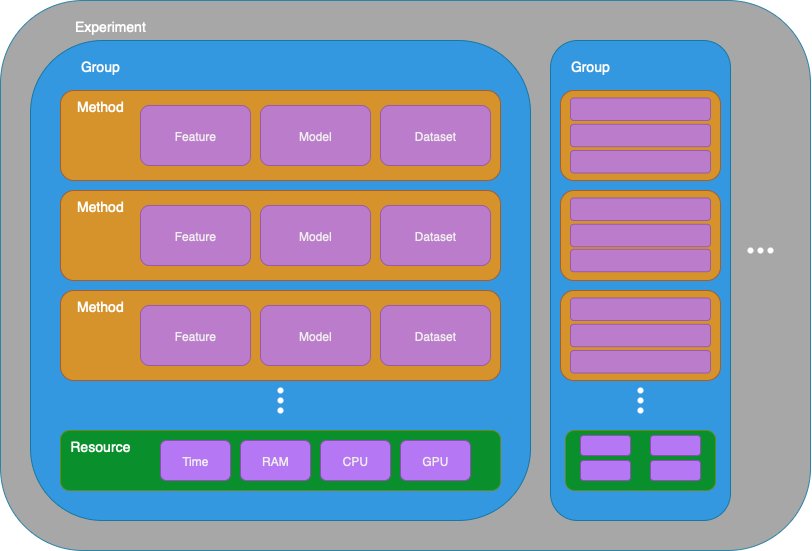

# ChemGridML: A small framework for high-throughput molecular ML experiments on SGE clusters

This project originated from my internship "Leveraging computational chemistry to optimise Machine Learning Models in Drug Discovery" at the UCL School of Pharmacy.

Its purpose is to provide an easy-to-use interface for molecular machine learning, supporting both local execution and SGE-based HPC systems (developed using UCL's Myriad cluster). A collection of molecular featurization methods and ML models are included, with code designed to be easily extensible. The cluster acceleration enables systematic exploration of many feature-model combinations to improve performance for a given dataset.

## Getting Started with ChemGridML

### For Users: Fork and Extend (Recommended)

Since ChemGridML is designed as a base framework for extension, the following workflow is recommended:

1. **Fork this repository** to your own GitHub account using the "Fork" button
2. **Clone your fork** locally:

    ```console
    git clone https://github.com/YOUR_USERNAME/ChemGridML.git
    cd ChemGridML
    ```

3. **Set the upstream remote** to stay updated with the original repository:

   ```console
   git remote add upstream https://github.com/JustDani-1/ChemGridML.git
   ```

4. **Make your extensions** (new feature, models, datasets, experiments, etc.)
5. **Commit and push** your changes to your fork
6. **Stay updated** with the original repository:

   ```console
   git fetch upstream
   git merge upstream/main
   ```

This approach allows you to:#

- Maintain your own version with custom extensions
- Receive updates from the original framework
- Optionally contribute improvements back via pull requests

### Alternative: Clone (for quick experimentation)

If you just want to test the framework quickly without maintaining your own version:

```console
git clone https://github.com/JustDani-1/ChemGridML.git
cd ChemGridML
```

Note: This approach makes it harder to preserve your changes when pulling updates.

## Setup

### Environment

There are two possbile ways to created the conda environment:

#### Option 1: Create environment from file

```console
conda env create -f environment.yml
```

#### Option 2: Using setup script

```console
# Make script executable
chmod +x environment.sh

# Run setup script
./environment.sh
```

### Setup on HPC clusters

In order to use a cluster, log onto it and execute:

```console
# Go into home directory
cd ~
# Create Scratch directory
mkdir -p Scratch
cd Scratch
# Clone your fork (recommended) or the original repository
git clone https://github.com/YOUR_USERNAME/ChemGridML.git  # Your fork
# OR
git clone https://github.com/JustDani-1/ChemGridML.git     # Original repo
cd ChemGridML
```

Afterwards, set up your conda environment as described above.

## Running Experiments

ChemGridML uses the following abstraction for executing ML experiments:



Available experiments are `FINGERPRINT`, `LEARNABLE` and `DATASIZE`, which where used during the development. These and all new experiments have to be defined in `/code/experiments.py`.

### Local

On the local machine, you can either run single methods of an experiments or entire experiments.
**To run a single method:**

```console
# Need to specify your own master job ID for the output folders
python ./code/main.py <MASTER_JOB_ID> <EXPERIMENT> <TASK_ID>
```

where the `TASK_ID` should be in the range of 1 and the total number of methods in that experiment.

**To run an entire experiment:**

```console
# Need to specify your own master job ID for the output folders
python master.py <MASTER_JOB_ID> <EXPERIMENT1> [EXPERIMENT2] ...
```

### Running on HPC clusters

The syntax for running experiments is:

```console
qsub ./scripts/submit_master.sh <EXPERIMENT1> [EXPERIMENT2] ...
```

For example:

```console
qsub ./scripts/submit_master.sh FINGERPRINT
```

The predictions of the experiments will be stored in `/studies/<MASTER_JOB_ID>`, the outputs & errors in `/output/<MASTER_JOB_ID>`

You can get a summary of your cluster jobs via:

```console
qstat
```

## Extending the Framework

To expand the framework with new features, models or datasets, alter the respective python file in `/code/`. The abstractions and interfaces in those files make it easy and intuitive to add new:

- **Molecular Features**
- **ML Models**
- **Datasets**
- **Experiments**

At the start of these files are instructions how to extend them.

### Contributing Back

If you've developed useful extensions that could benefit the broader community, consider submitting a pull request:

1. Push your changes to your fork
2. Create a pull request from your fork to the original repository
3. Describe your additions and their potential benefits
